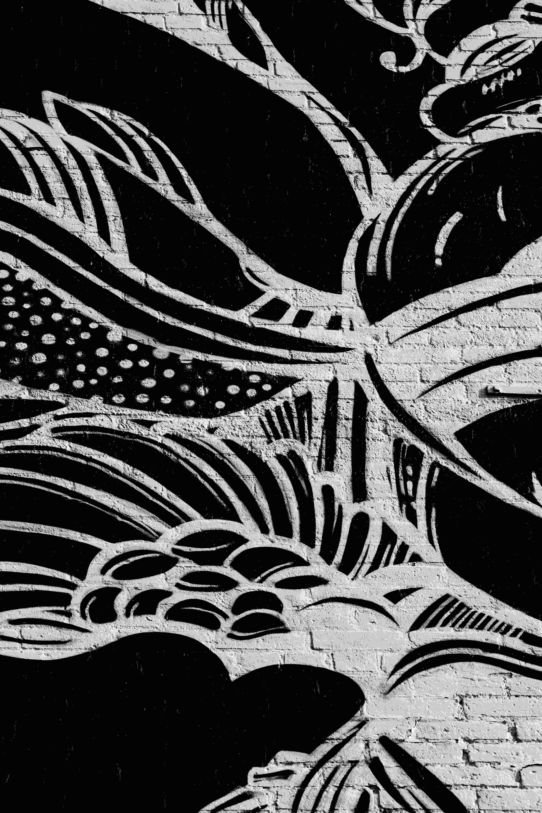

# Sneakers Vault 👟

[🔗 View live website here](https://sneakers-vault-jet.vercel.app)


---

## Table of Contents

- [Project](#project)
  - [Objective](#objective)
  - [User Goals](#user-goals)
  - [Project Management](#project-management)
  - [User Stories](#user-stories)

- [User Experience (UX)](#user-experience-ux)
  - [Wireframes](#wireframes)
  - [Site Structure](#site-structure)
  - [Design Choices](#design-choices)

- [Existing Features](#existing-features)
  - [Navigation](#navigation)
  - [Homepage](#homepage)
  - [Shop Page](#shop-page)
  - [Product Detail](#product-detail)
  - [Cart](#cart)
  - [Checkout](#checkout)
  - [Success / Cancel Pages](#success-cancel-pages)
  - [Contact Page](#contact-page)
  - [404 Page](#404-page)

- [Technologies Used](#technologies-used)
  - [Languages](#languages)
  - [Frameworks & Software](#frameworks--software)
  - [Libraries](#libraries)

- [Future Features](#future-features)

- [Testing](#testing)

- [Deployment](#deployment)

- [Credits](#credits)

---

# 🛠️ Project

## 🎯 Objective

Sneakers Vault is a modern, responsive e-commerce website designed for sneaker lovers. It allows users to explore a curated selection of sneakers, filter by category or brand, view detailed product info, and complete purchases using Stripe Checkout.

## 👥 User Goals

- Discover new arrivals and promotions
- Use filters to easily find desired sneakers
- Search by keyword or brand
- View detailed product pages
- Add items to cart and manage them
- Choose delivery options and time slot
- Complete secure payments via Stripe

## 🎯 Site Owner Goals

- Provide a seamless, intuitive shopping experience
- Highlight exclusive and trending sneakers
- Manage orders and support multiple languages
- Build a scalable foundation for future features

## 📋 Project Management

GitHub Projects board used to organize and track all tasks and user stories:

[🔗 GitHub Project Board](https://github.com/users/alelodato/projects/8)

---

## 🧑‍💻 User Stories


| Category   | As a... | I want to...                        | So that I can...                                          |
|------------|---------|-------------------------------------|-----------------------------------------------------------|
| Homepage   | Developer | See my navbar, and homepage content rendering when website is loaded | Can see the homepage is the first page loaded when a user is opening the website and all content is shown properly|
| Homepage   | User | Browse featured products            | Quickly see hot, new, and discounted items               |
| Navbar | Developer | My navbar to be shown at the top of all the website pages, showing the shop logo in the center, shop and search icons on the left and wishlist and cart on the right.               | Is intuitive for Users and has an elegant display       |
| Navbar | User | The navbar icons to be intuitive and to easily redirect me to: shop page, wishlist, and cart, with the search icon activating the filtered search when clicked.              | Can navigate the website easily       |
| Navigation | User | Use category buttons                | Jump to filtered shop view for men, women, or kids       |
| Products   | User | Apply filters by brand, color, size | Find what I’m looking for faster                         |
| Products   | User | Search by keyword                   | Locate specific items                                     |
| Cart       | User    | Add or remove items                 | Manage what I want to buy                                |
| Cart       | User    | Update quantity and view total      | Keep track of my selections                              |
| Checkout   | User    | Choose delivery or pickup           | Select preferred delivery method                         |
| Checkout   | Developer   | Connect my website to Stripe using a backend server           | Can use the Stripe checkout services for user payments                              |
| Checkout   | User    | Pay securely via Stripe             | Complete my purchase safely                              |
| Wishlist  | User    |  Be able to store my favourite items in a wishlist              | Can pick the one i like the most in the shop and find them easily also at a later time.               |
| Languages  | User    | Switch language easily              | Navigate the site in my preferred language               |

---

# 💡 User Experience (UX)

## Wireframes

Initial wireframes were sketched to guide layout decisions with a mobile-first approach.

<details><summary><b>Wireframes</b></summary>

  


</details>

## Site Structure

- `/` → Homepage
- `/shop` → All products with filters
- `/product/:id` → Product detail page
- `/cart` → Cart
- `/checkout` → Stripe Checkout
- `/success` → Success page
- `/cancel` → Cancel page
- `/contact` → Contact form
- `*` → 404 Not Found

## Design Choices

- **Color palette:** White(#fff) with black icons and logo for the navbar,different background images for: **Homepage**  **Shop Page**  **Wishlist,Cart** and **Checkout** .
- **Typography:** For the logo i've used the font [Rock Salt](https://fonts.google.com/specimen/Rock+Salt) which i found modern and appropriate for a retail shop logo;
I've then used the [Bebas Neue](https://fonts.google.com/specimen/Bebas+Neue)font for the homepage header, as i think the font has a strong visual impact and it's perfect to be used as a hero section header, so one of the first elements seen by a user.
For the rest of the content I decided to use the [Oxanium](https://fonts.google.com/specimen/Oxanium) font which i find modern but still easy to read, with a kind of futuristic font design that i found appropriate for the concept of the website and the user target. The icons used in the project have been taken from [Font Awesome](https://fontawesome.com/).
- **Layout:** I've designed the website to be mobile first, with elements that are responsive adapting and in some occasions also changing shape and layout on larger screens.
- **Animations:** Subtle interactions like the wishlist icon becoming red when an item is added to the wishlist and hover effects, as i think for this kind of project animations should have been kept minimal to maximise user experience.
- **Accessibility:** Semantic HTML and alt texts for all images.

---

# 🚀 Existing Features

## Navigation

- Responsive navbar with icons redirecting to shop, wishlist and cart pages, and also featuring a searchbar.
- Links shop page filtered with men,women,kids,trending,discounted and new items.Also link redirecting from the homepage to the contact page.
- Multilingual (EN, IT, ES, FR, DE) via `react-i18next`

## Homepage

- Hero section with header, background image and buttons redirecting to shop page filtered with men,women and kids products `/shop?tag=...`;
- Responsive products layout;
- Sections for Hot, Sale, and New products with a Featured product rotator, switching products with a set time interval;
- Contact link redirecting to contact page;
- Language switch at the bottom of the page.

## Shop Page

- Grid of all products;
- Dynamic filters by brand, color, size, and tag;
- Responsive products layout;
- All filters update in real time.

## Product Detail

- Product image;
- Title, description, price, and discount if applied;
- Selectable sizes (if available);
- Add to cart with instant feedback;
- Wishlist toggle icon.

## Cart

- List of products with quantity selector;
- Dynamic price updates and total;
- Remove items or clear entire cart;
- Choose size and see it reflected in cart;
- Responsive layout with mobile optimization.

## Checkout

- Stripe Checkout integration via `createCheckoutSession`;
- Toggle delivery option and time slot before payment;
- Secure and simple Stripe-hosted payment flow.

## Success / Cancel Pages

- `/success` confirms the order and thanks the user;
- `/cancel` lets user retry if payment fails or is cancelled.

## Contact Page

- Responsive contact form with Name, Email, and Message;
- Styled for desktop and mobile;
- Other contacts and social icons at the bottom of the page.

## 404 Page

- Custom “Page Not Found” page;
- Styled message and navigation link back to Home.

---

# 🧪 Technologies Used

## Languages

- HTML5
- CSS3 (modules)
- JavaScript (ES6)
- JSX

## Frameworks & Software

- React
- Node.js + Express (backend)
- Vite
- Railway (backend deployment)
- Vercel (frontend deployment)

## Libraries

- React Router
- Stripe JS & Stripe SDK
- React Toastify
- Axios
- React Icons
- `react-i18next` (internationalization)
- Dotenv
- ESLint + Prettier
- Vitest + React Testing Library (for testing)

---

# 🧩 Future Features

- Email confirmation after purchase
- User authentication (sign up / login)
- Admin dashboard to manage inventory and orders
- Persistent cart using localStorage or backend
- Product rating and reviews
- Pagination or infinite scroll in Shop
- Filtering by price range
- Sort by popularity or newest
- Newsletter signup form

---

# 🧪 Testing

See full testing documentation in [`TESTING.md`](./TESTING.md)  
Includes:

- ✅ Automated unit tests (Vitest + React Testing Library)
- ✅ Manual tests with expected results
- ❗ Known bugs and future testing plans

---

# 🚀 Deployment

## Frontend

- Deployed on [Vercel](https://sneakers-vault-jet.vercel.app)

## Backend

- Node/Express server deployed via [Railway](https://railway.app/)
- Manages Stripe session creation via `/create-checkout-session`

## Setup Instructions

```bash
git clone https://github.com/alelodato/sneakers-vault
cd sneakers-vault
npm install
npm run dev
